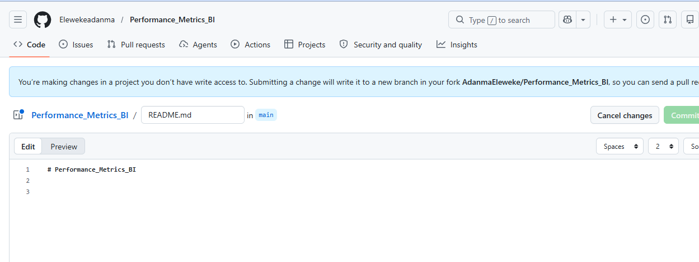
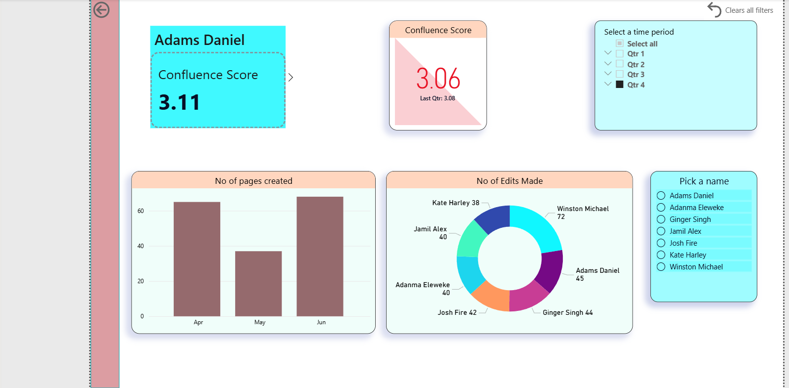

# Performance_Metrics_BI

This Power BI dashboard provides a high-level overview of data analytics performance metrics for an individual (currently filtered to Josh Fire).

 Overall Summary
The report is an “Overview” page titled “Data Analytics Performance Metrics”, designed to track performance across multiple tools and activities. It uses card visuals to display key scores and slicers for filtering.

Key Metrics (for Josh Fire)
Four core performance indicators are shown as scorecards:

GitHub Score: 3.14
→ Reflects code contributions or activity level on GitHub

Jira Score: 3.04
→ Indicates task management, ticket completion, or project contributions

Attendance: 2.98
→ Measures presence or participation (likely meetings or workdays)

Confluence Score: 3.00
→ Represents documentation, knowledge sharing, or collaboration activity

 Filters / Interactivity
The dashboard supports dynamic filtering:

Quarter / Month slicer (bottom left):

Options: Qtr 1, Qtr 2, Qtr 3, Qtr 4, or Select all
→ Allows performance comparison over time

Name selector (bottom right):

Options include multiple individuals (e.g., Adams Daniel, Adanma Eleweke, Ginger Singh, Josh Fire, etc.)
→ Lets users switch between team members

Structure & Navigation

This is Page 1: “Overview” of a multi-page report
Additional pages (visible at the bottom) include:

Confluence
Jira
Github
Attendance
Processes

👉 These likely provide detailed drill-downs for each metric category.

The dashboard tracks Confluence activity performance across users, focusing on:

Individual performance scores
Content creation (pages)
Editing contributions
Time-based filtering

Confluence Score Trend

Current Score (another KPI): 3.06
Last Quarter Score: 3.08

👉 Insight:

Slight decline in score compared to the previous quarter.

Time Filter

Quarter selection panel is available:

Qtr 1, Qtr 2, Qtr 3, Qtr 4

Qtr 4 is selected

👉 This means all displayed metrics are currently filtered for Quarter 4.

Pages Created (Bar Chart)

Shows monthly breakdown:

April: ~65 pages
May: ~36 pages
June: ~70 pages

👉 Insights:

June has the highest output
May shows a drop in productivity
Overall trend: dip in May → strong rebound in June

Key Takeaways

Slight decline in overall Confluence score
Content creation peaked in June
Editing activity is dominated by one user, but otherwise evenly distributed
Dashboard is interactive, allowing filtering by user and time period